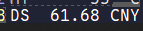

# DeepSeek Balance Assistant (DeepSeekDeskBand)



A [TrafficMonitor](https://github.com/zhongyang219/TrafficMonitor) desk band plugin that displays real-time DeepSeek official balance information in the taskbar window, with balance change history support.

English | [简体中文](README.zh-Hans.md) | [繁體中文](README.zh-Hant.md) | [日本語](README.ja.md) | [Deutsch](README.de.md) | [עברית](README.he.md) | [Magyar](README.hu.md) | [Italiano](README.it.md) | [Polski](README.pl.md) | [Português (Brasil)](README.pt-BR.md) | [Русский](README.ru.md) | [Türkçe](README.tr.md)

## Features

- Periodically queries DeepSeek official API for balance
- Displays balance value and currency in TrafficMonitor's taskbar and main window
- Balance change history (automatic incremental storage, configurable limit)
- Multi-language support (auto-detection from system language or manual selection)
- Configuration file (including API Key) and history encrypted with Windows DPAPI, accessible only by the current Windows user

## Installation

1. Download the appropriate DLL from [Release](https://github.com/KagurazakaYashi/TrafficMonitorPlugin-DeepSeekDeskBand/releases):
   - x86 TrafficMonitor → `DeepSeekDeskBand.dll`
   - x64 TrafficMonitor → `DeepSeekDeskBand64.dll`
2. Copy the DLL to the `plugins` folder under the TrafficMonitor program directory
3. Restart TrafficMonitor
4. Right-click on the taskbar empty area, select "Show Settings", and check "DeepSeek Balance Assistant" to display

> **Note**: The DLL must be placed in the `plugins` subfolder; it cannot be loaded from other directories.

## Display Content

The plugin display consists of two parts:

- **Left label text**: Can be modified in TrafficMonitor's "Options" → "Taskbar Window Settings" → "Display Text Settings".
- **Right value text**: Displays `balance currency`, e.g. `100.00 CNY`. Balance data updates automatically at regular intervals.

In TrafficMonitor's right-click menu under the "Display Items" submenu, the plugin's display name changes with the language setting (e.g. "DeepSeek Balance Assistant" in the English environment).

## Opening the Plugin Configuration Window

Right-click on TrafficMonitor's taskbar window or main window, select "Plugin Management" in the right-click menu, right-click on this plugin and select "Options" to open the configuration dialog. In the configuration dialog, you can set API Key and other options, as well as view history records.

## Configuration Options

### DeepSeek API Key

- Enter your [DeepSeek API Key](https://platform.deepseek.com/api_keys) in the input field
- The key is displayed in password mask mode (plaintext is not shown)
- Real-time format validation below the input field: must start with `sk-`, followed by 32 alphanumeric characters
- Once the format is valid, click the "Test API" button to verify the key
- After passing the test, a balance details dialog will appear and the OK button becomes enabled

> **You must pass the API test** before clicking OK to save. If the key is empty (no display needed), you can save directly.

### Update Interval (seconds)

- Default: **60** seconds
- Range: 1 ~ 31536000
- Automatically queries the DeepSeek API balance every set number of seconds
- The update interval must be greater than the request timeout, otherwise it cannot be saved

### Request Timeout (seconds)

- Default: **10** seconds
- Range: 3 ~ 60 seconds
- Maximum wait time for an API request; exceeding this time is treated as a failed request
- Adjust based on network conditions; increase if the network is poor

### History Record Count

- Default: **1000** records
- Range: 0 ~ 10000 (set to 0 to disable history recording)
- New records are only added when the balance actually changes (difference > 0.001), avoiding redundancy
- Old records exceeding the limit are automatically purged

### Auto Refresh

- Checked by default
- When checked, the history list refreshes automatically every second
- Clicking anywhere on the list cancels auto refresh

### Display Language

- Default is "Auto" (automatically detects based on system language)
- Supports 12 languages: 简体中文, 繁體中文, 日本語, English, Deutsch, עברית, Magyar, Italiano, Polski, Português (Brasil), Русский, Türkçe
- Switching languages takes effect immediately in the dialog, but clicking the "OK" button is required for persistent saving

### Clear History

- Click the "Clear History" button and confirm to erase all history records
- This operation is irreversible

## Build

### Requirements

- Visual Studio 2026 (v145 toolset)
- Windows 10 SDK or later
- The `/utf-8` compiler option must be enabled (required for Chinese source code)

### Quick Build (Recommended)

```batch
build.bat
```

Automatically compiles the Release configuration based on the current system architecture and copies the generated DLL to `C:\TrafficMonitor\plugins\`.

> **Note**: Modify the `PLUGINDIR` variable in `build.bat` according to the actual installation path of TrafficMonitor.

### Manual Build

```batch
MSBuild DeepSeekDeskBand.sln /t:Rebuild /p:Configuration=Release /p:Platform=x86
MSBuild DeepSeekDeskBand.sln /t:Rebuild /p:Configuration=Release /p:Platform=x64
```

### Output Files

| Platform | Configuration | Output File                          |
|----------|---------------|--------------------------------------|
| x86      | Debug         | `Debug\DeepSeekDeskBand.dll`         |
| x86      | Release       | `Release\DeepSeekDeskBand.dll`       |
| x64      | Debug         | `x64\Debug\DeepSeekDeskBand64.dll`   |
| x64      | Release       | `x64\Release\DeepSeekDeskBand64.dll` |

## Privacy & Data Security

This plugin takes user privacy and data security seriously:

- **API Key**: Encrypted and stored locally using Windows DPAPI in `DeepSeekDeskBand.dat`, accessible and decryptable only by the current Windows user. The key is never uploaded to any third party.
- **Balance Data**: Retrieved solely via HTTPS from the DeepSeek official API (`api.deepseek.com`), without passing through any intermediate servers.
- **History Records**: Balance change records are encrypted and stored locally using DPAPI in `DeepSeekDeskBand_History.dat`, accessible only by the current Windows user.
- **Network Requests**: Only HTTPS requests are sent to `api.deepseek.com` (Authorization: Bearer Token); no other domains are contacted.
- **No Data Collection**: This plugin does not collect or upload any user data or usage statistics.
- **Icon Cache**: The icon (favicon.ico) is downloaded from `www.deepseek.com` only once when the settings dialog is opened for the first time, and cached in the plugin configuration directory.

## Technical Notes

- Plugin Interface: TrafficMonitor API v7
- No MFC dependency, pure Win32 C++ implementation
- Singleton pattern for plugin instance management
- WinHTTP HTTPS client
- Balance change detection threshold > 0.001 to reduce redundant records

## License

Copyright (c) 2026 KagurazakaYashi (KagurazakaMiyabi)

This project is open-sourced under the Mulan PSL v2 license. You may use this software in compliance with the terms of Mulan PSL v2. A copy of the license can be found at: http://license.coscl.org.cn/MulanPSL2

This software is provided "as is", without warranty of any kind, express or implied, including but not limited to the warranties of merchantability, fitness for a particular purpose, and non-infringement.
